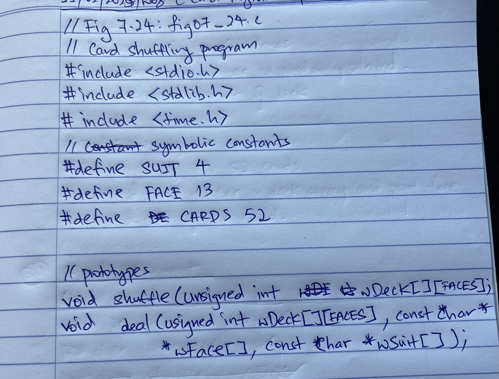
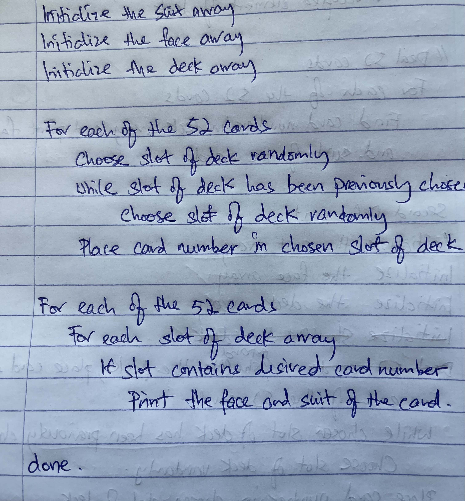

# Learning Journal

## C How to Program (8th Edition) - Paul & Harvey Deitel

### Week 08
- started on Chapter 7 on C Pointers
- learnt that the ampersand operator & calls the address of the variable defined
- learnt that the indirection operator * points to an address in memory
- both are complementary of each other
- learnt that passing by reference can alter a variable identifier without returning a value
- To apply the principle of least priviledge, if it is a scalar parameter better to use return values for more explicitity
- learnt about the type `const` in C where it doesn't allow the assigment of data to be changed
- `const` types allows addresses to be pointed but not changed
- learnt pointer notation and index notation copying of data.
- hand wrote Pseudo codes using top wise step down refinement approach for a card shuffling system
- experimented with reasoning models (o1 and R1) to read from image of handwritten Pesudocodes

#### Generated Codes in Dir Chapter 7


#### From handwritten codes


### Week 07
- learnt using C for bubbleSort
- bubbleSort is a type of sorting algorithm where the elements bubbles up or down in ascending or descending order
- learnt to compute mean, median and mode using C
- learnt LinearSearch and BinarySearch.
- LinearSearch is used for smaller array lengths. Binary for larger and it is much quicker in decomposing the elements
- learnt C array one and multidimensional initialization and  manupilations
- learnt variable-length array initialization if data of arrays are not known during compilation time
- learnt that we are able to compile C codes into various C standards by specifiying the standard convention during compile time
- completed Chapter 6!

### Week 06
- completed Chapter 5 Learnings
- committed code learnings for recursive calls using fibonacci numbers
- commited code learnings for recursive function calls for factorials `(n!)`
- started Chapter 6 on C Arrays
- learnt to initialize arrays with `int` and `char` datatypes
- learnt that in C these are usually mutuable and with other classes later in the chapters then there maybe some immutability. such are `const` and `struct` where the values of these elements cannot be changed
- refactored `fig05_12.c` into `fig06_09.c` summarizing the 60,000,000 die roll with arrays
- learnt that in type settings of `printf` and `scanf` the numbers like `<conversion_specifier>``<number`>`<datatype>` represents the number of characters or ints within the variable identifier specified.
- learnt that addresses of memory of arrays are all the same. therefore passing by reference is possible by just passing in the variable identifier of the array identifier. (see program `fig06_12`)
- stopped at section 6.8

### Week 05
- added Chapter 4's example codes into repo
- learnt for, while, do..while control flow
- learnt flow control statements in break and continue
- learnt logical AND `&&`, logical OR `||`, logical Negation `!` commands that evaluates conditions
- explored header files in the std library but compiling with the `-H` flag for the paths
- started Chapter 5 in C function structures
- learnt how an OS will interact with stacking and returning of values in C
- learnt that `function prototypes` is declared for type checking, however concrete definitions is declared in a separate function
- both prototypes and concrete definitions must have identical identifies, and data types in its headers.
- learnt that `.h` header function protypes do no need to be compiled
- learnt passing arguments by value in C functions
- coded a simulation of craps to show how `rand()` is used and how `srand()` implicitly inputs the starting seed of `rand()`
- briefly used enum and how constants in C syntax works. Constant variable identifers are in CAPITALS. and the array of strings are represented by integers `0, 1, 2, 3....n` for any given constant identifiers
- these variables are also called constant integer identifiers
- wrote a program to understand scoping of `auto`, `extern`, `static` storage classes
- `auto` storage classes are variables within a function definition, and exists when it enters a code block and destroyed when the code block ends
- `extern` storage classes are for variables such as Global variables which exists until the program terminates
- `static` storage classes store the previous value of the variable identifier and uses it when a code block is entered next. it gets destroyed when the program terminates.
- scoping of variables applies the `Principle of Least Privilege` where variables that a function or code block needs is given access.

### Week 04
- completed up to 2.16 of chapter 2's exercises

### Week 03
- completed Chapter 2's exercises
- completed Chapter 3 contents
- need to understand what are platform integer limits to prevent overflow as it may pose a security attack

### Week 02
- Started exercises in Chapter 2. Stopped mid-week at section 2.5, page 81
- organized all codes into dir by chapters
- completed Case Study 1 and Case Study 2 of C Alogrithms
- learnt to break down problem statements to pseudocodes into sequential, selection and iterative structures
- learnt about cast operands which temporary explicitly converts the datatypes of variables into another datatype (e.g int to float)

### Week 01
- Cloned the repository: [CHowToProgram](https://github.com/pdeitel/CHowToProgram8e.git)
- Used the following compiler:
  ```
  Apple clang version 14.0.3 (clang-1403.0.22.14.1)
  Target: arm64-apple-darwin24.1.0
  Thread model: posix
  InstalledDir: /Library/Developer/CommandLineTools/usr/bin
  ```
- Compiled `GuessNumber.c` into an executable named `GuessNumber`.
- Modified `GuessNumber.c` to print the answer before running in `examples/ch01`.
